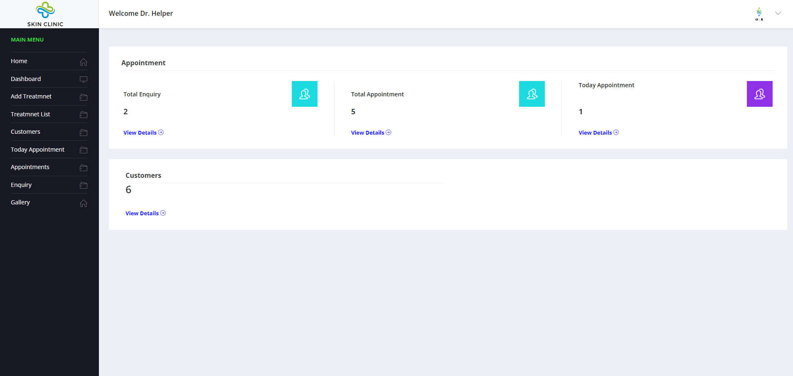
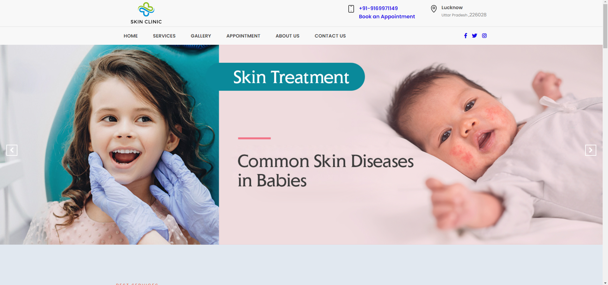
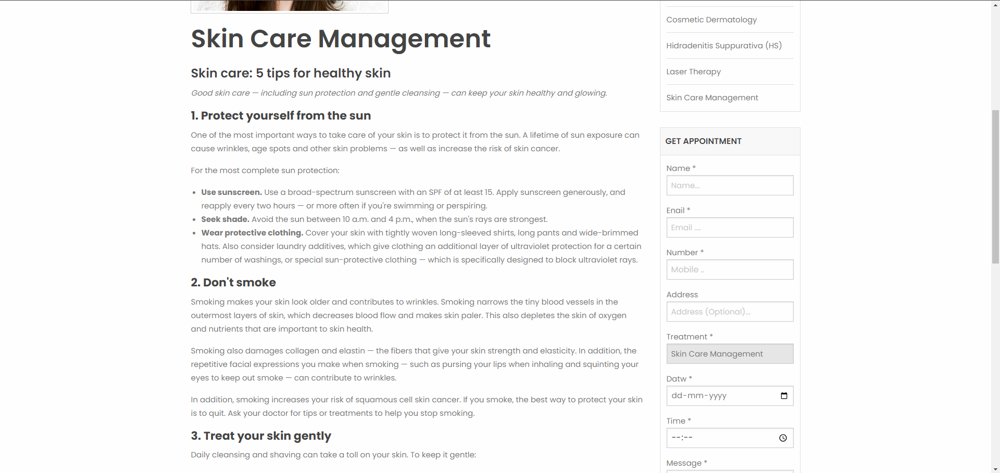
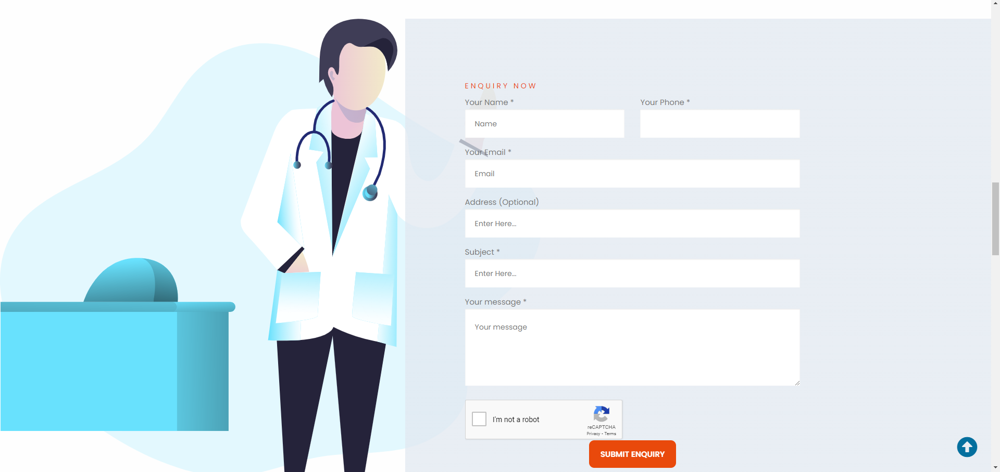

# Skincare Website

Welcome to the Skincare Website repository! This project is a website dedicated to skincare, created for learning purposes.

## Features

- **Gallery:** Browse through a collection of skincare images.
- **Treatments:** Learn about various skincare options and treatments.
- **Appointments:** Schedule virtual appointments for skincare consultations.
- **Contact:** Reach out for inquiries or assistance.

## Technologies Used

- HTML
- CSS
- Bootstrap
- JavaScript
- PHP
- MySQL

## Installation

To run this project locally, follow these steps:

1. Clone the repository: `git clone [repository-url]`
2. Navigate to the project directory: `cd skincare-website`
3. Open the project in your code editor.
4. Set up a local server environment (e.g., XAMPP, WAMP) for PHP and MySQL.
5. Import the database schema from `database.sql`.
6. Update the database connection settings in `config.php`.
7. Launch the project in your web browser.

## Screenshots

Here are some screenshots of the Skincare Website:

## Contributing

Contributions are welcome! If you'd like to contribute to this project, please follow these guidelines:

1. Fork the repository.
2. Create a new branch: `git checkout -b feature-name`
3. Commit your changes: `git commit -m 'Add some feature'`
4. Push to the branch: `git push origin feature-name`
5. Submit a pull request.

## License

This project is licensed under the [MIT License](LICENSE).
